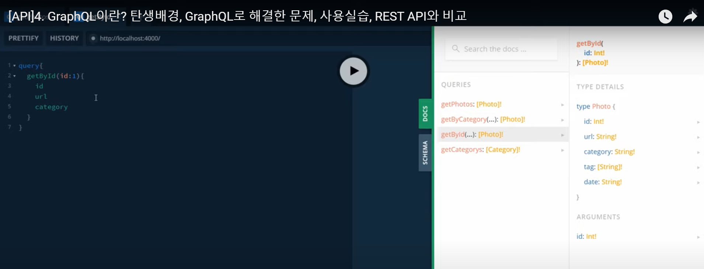
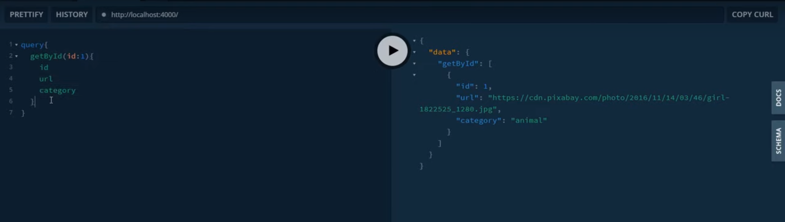
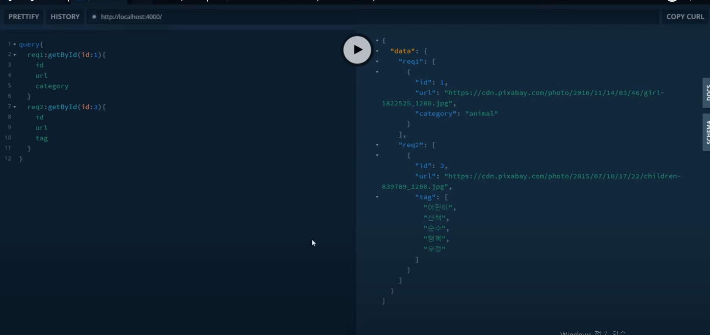
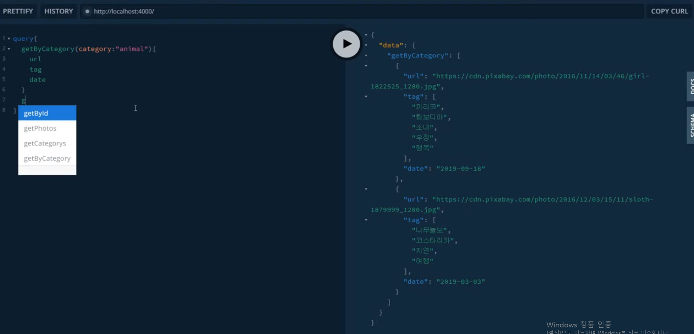
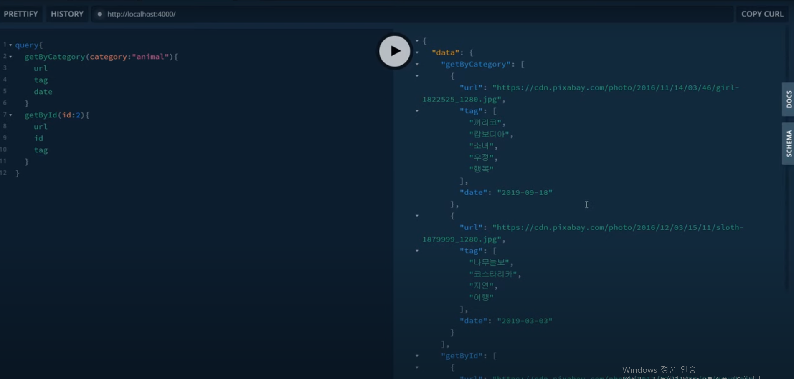

- [API]4. GraphQL이란? 탄생배경, GraphQL로 해결한 문제, 사용실습, REST API와 비교
- https://www.youtube.com/watch?v=xiE9-S7s9rs

페이스북에서 만들었음
기기별로 다양한 기기에서 필요한 정보가 달랐음
정보를 요청하는 쪽에서 원하는 형태로 정보를 가져오고 수정할 수 있는 쿼리 랭기지를 만들게되었다

STATE OF JS에서 조회
프론트앤드프레임워크-데이터레이어
그래프큐엘에서 아폴로를 사용하면 더 효율적입니다
개발자들은 그래프큐엘에 대해서 긍정적입니다

graphql.org
graphql-kr.github.io

API를 위한 쿼리언어
필요한것을 정확하게 요청
강력한 개발자도구를 지원

필요한것만 정확히 얻습니다
항상 예측 가능한 결과를 반환합니다

한번의 요청으로 앱에 필요한 모든 데이터를 가져옵니다

그래프큐엘은 자체적으로 도구를 제공합니다

첫번쨰 문제
실제로 필요한 데이터가
사진의 태그와 url이면
필요없는 데이터를 받습니다
-> 불필요한 데이터까지 전달받음
-> id만 전달, id와 url만 전달, tag만 전달
-> Over-Fetching
-> 불필요한 리소스 낭비
-> 필요한 정보만 골라내는 추가작업이 발생

Under-fetching
필요한 데이터를 만들기 위해
여러번의 호출이 필요

-> 추가적인 리소스 요청이필요
-> 여러요청을 ㅏㅂㅇ
-> API마다 다른 URL이 존재
-> 경우에 따라 수십,수백개의 api가 존재
-> API를 만들면 일일히 이름을 지어야함

GraphQL의 Operation type
query : 데이터 조회
Mutation : 데이터 수정
subscription : 주로 실시간 애플리케이션 구현을 위해 사용

여러가지 api결과 한번에 수신가능

사용자가 직접 어떤 데이터가 필요한지 명시할 수 있도록합니다

RestAPI -> GraphQL
어렵지않음