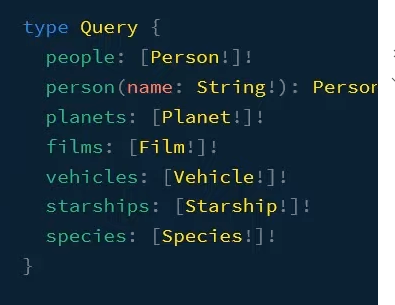
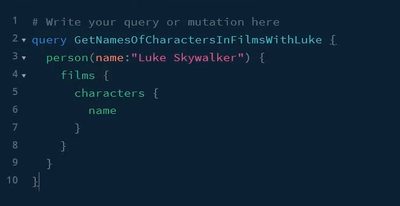
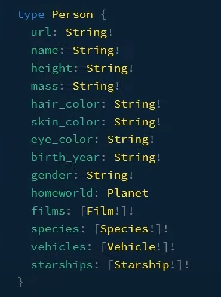
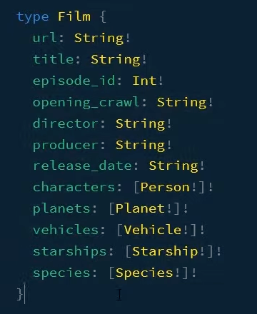
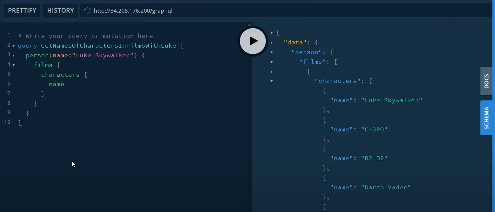

graphql playground = graphql ide

필드의 유형을 알 수 있음

1. 루트쿼리를 찾는다

2. query를 작성한다 (루트쿼리에서 찾을수있는 person)

3. 추가적으로 영화도 찾을려면 추가
filems

4. 결과

정확한 데이터를 캡쳐한다
client-side state management
http은 많은전송기술일뿐 다른 곳에서도 가능

Query (read)
Mutation (write)
SUbscription

구문분석과 유효성 검사