## Hello, GraphQL! Graph QL 도입으로 얻었던 효과 - 조민환
https://www.youtube.com/watch?v=1p-s99REAus

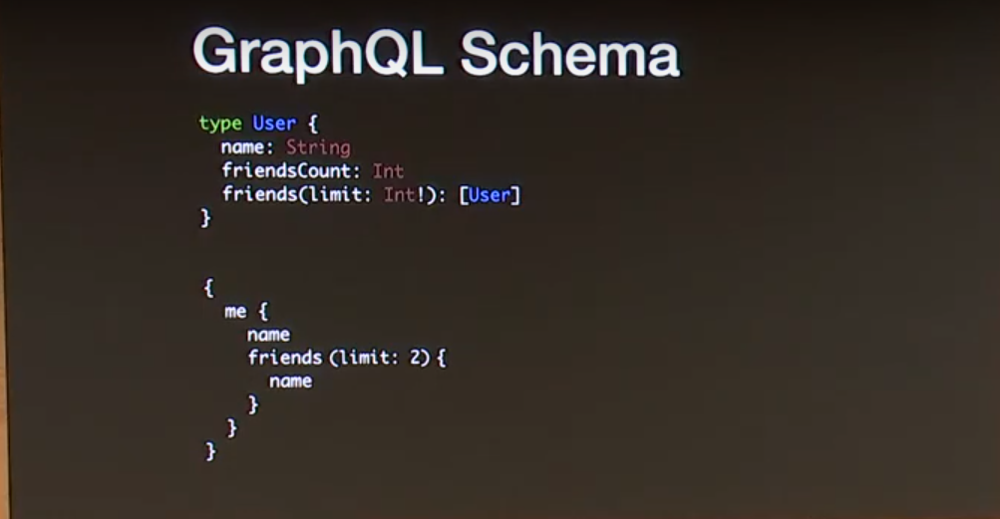

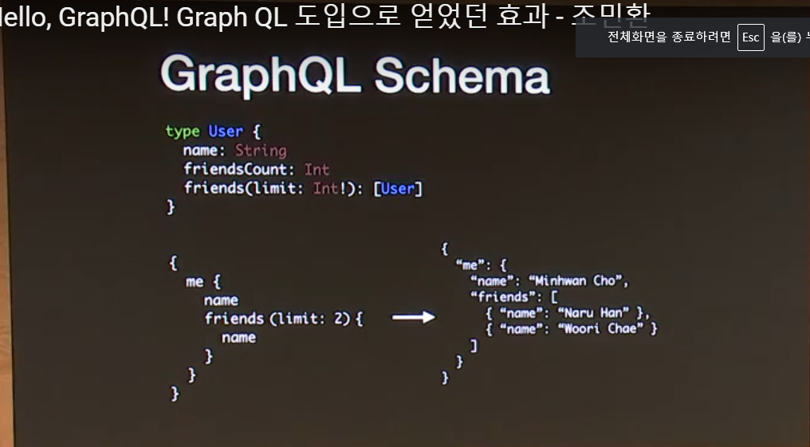

react native도 비슷한 사상
-> react 패러다임
-> 한번만 정의하면 여러 플랫폼에서 쓸수있다
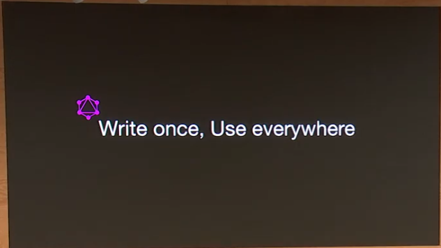

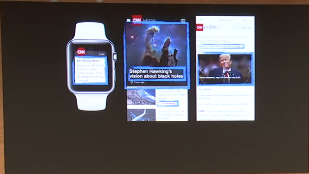

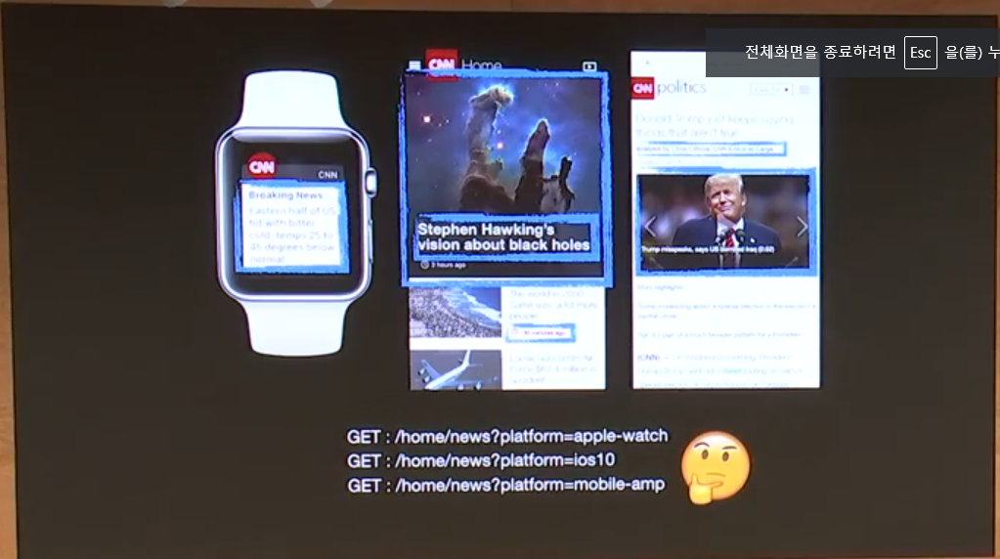

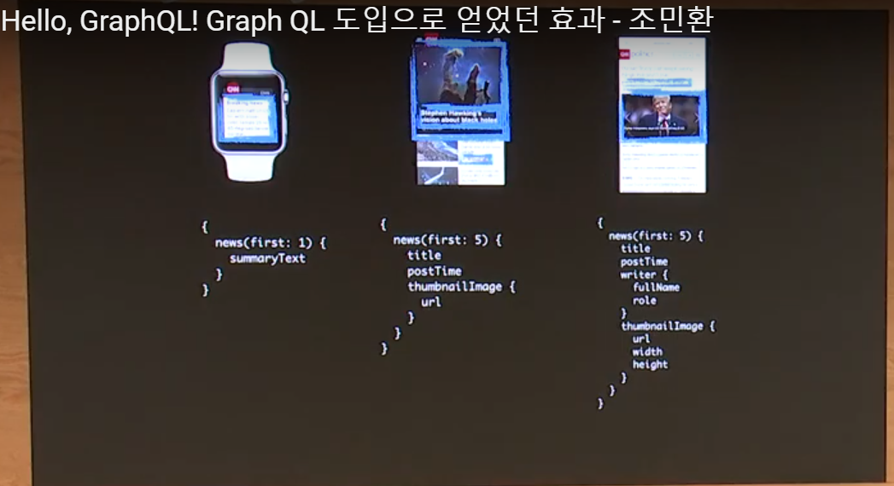

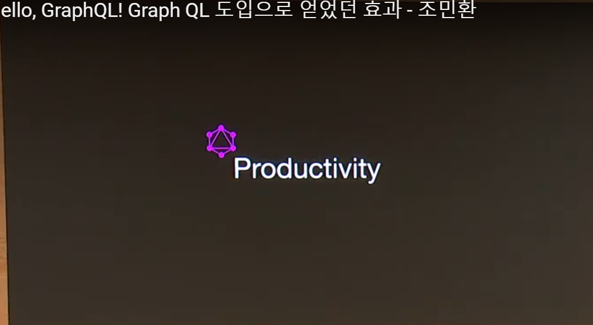

workingday 하루
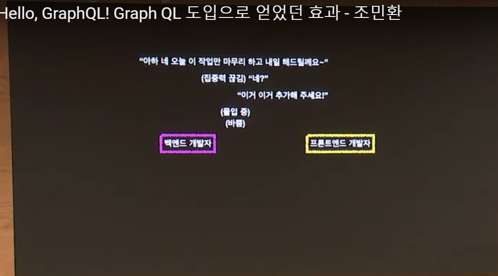

iteration이 많이 돌고, 피드백을 받아야함
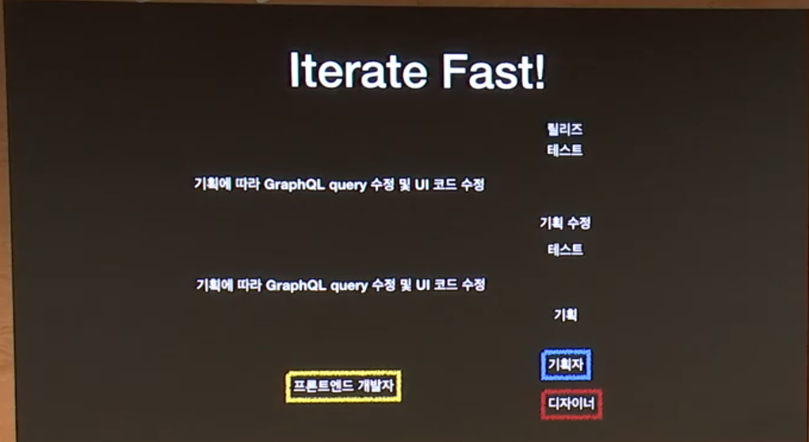

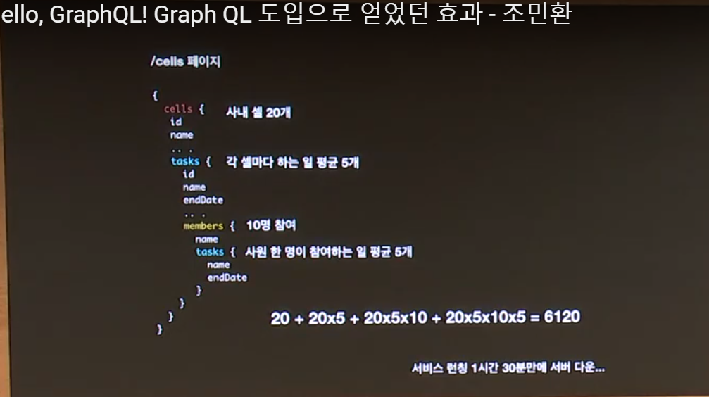

graphql depth 줄이기
dataloader 라이브러리 사용

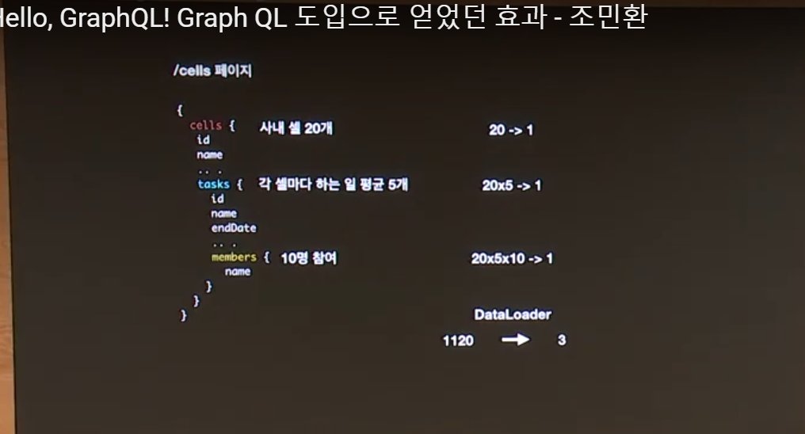

유연함은 공짜가 아니다
캐시
Dataloader
Persited Query